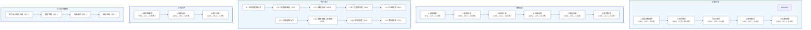

```mermaid
graph TD
    %% 定义横向泳道（从上到下排列）
    subgraph 设备订货
        direction 
        A1["1.协议初稿提供<br>（10%，15人，3.2天）"] --> A2["2.技术谈判<br>（40%，15人，12.8天）"]
        A2 --> A3["3.协议签订<br>（20%，15人，6.4天）"]
        A3 --> A4["4.图纸确认<br>（20%，15人，6.4天）"]
        A4 --> A5["5.设备闭环<br>（10%，15人，3.2天）"]
    end

    subgraph 详细设计
        direction LR
        B1["1.总图熟悉<br>（5%，15人，4.2天）"] --> B2["2.图纸设绘<br>（40%，15人，33.6天）"]
        B2 --> B3["3.图纸评审<br>（15%，15人，12.6天）"]
        B3 --> B4["4.送审闭环<br>（20%，15人，16.8天）"]
        B4 --> B5["5.修改升版<br>（10%，15人，8.4天）"]
        B5 --> B6["6.模型检查<br>（10%，15人，8.4天）"]
    end

    subgraph 生产设计
        direction LR
        %% 管系设计分支
        C1["3.1.1 机舱管路分工"] --> C2["3.1.2 布置图熟悉（2%）"]
        C2 --> C3["3.1.2 建模设计（35%）"]
        C3 --> C4["3.1.2 完整性检查（8%）"]
        C4 --> C5["3.1.2 托盘发布（5%）"]
        
        %% 舾装设计分支
        D1["3.2.1 机舱舾装分工"] --> D2["3.2.2 模型放样（设备类24%）"]
        D2 --> D3["3.2.2 模型调整（5%）"]
        D3 --> D4["3.2.2 数据发布（5%）"]
    end

    subgraph 工艺文件
        direction LR
        E1["1.原理图熟悉<br>（5%，15人，0.85天）"] --> E2["2.图纸设绘<br>（40%，15人，6.8天）"]
        E2 --> E3["6.施工交底<br>（10%，15人，1.7天）"]
    end

    subgraph 设计过程管控
        direction LR
        F1["生产设计输入评审（3人）"] --> F2["模型平衡（3人）"]
        F2 --> F3["专题研讨（3人）"]
        F3 --> F4["输出评审（3人）"]
    end

    classDef lane fill:#f0f6ff,stroke:#3a7bd5,stroke-width:2px;
    classDef task fill:#fff,stroke:#1e3c72,rx:5,ry:5;
    class 设备订货,详细设计,生产设计,工艺文件,设计过程管控 lane;
    class A1,A2,A3,A4,A5,B1,B2,B3,B4,B5,B6,C1,C2,C3,C4,C5,D1,D2,D3,D4,E1,E2,E3,F1,F2,F3,F4 task;
```