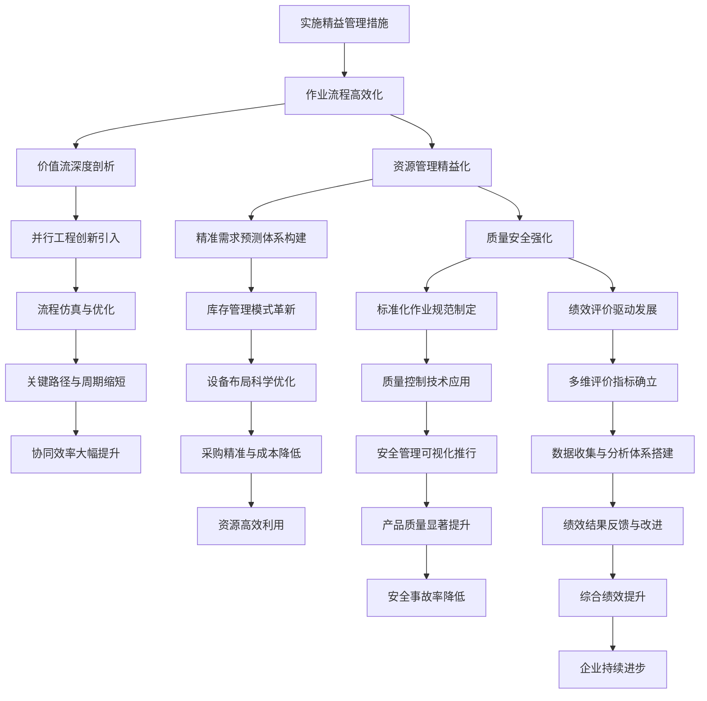

```mermaid
graph TD;
    成果1[作业流程高效化]
        --> A1[价值流深度剖析]
        --> A2[并行工程创新引入]
        --> A3[流程仿真与优化]
        --> A4[关键路径与周期缩短]
        --> A5[协同效率大幅提升]
    成果2[资源管理精益化]
        --> B1[精准需求预测体系构建]
        --> B2[库存管理模式革新]
        --> B3[设备布局科学优化]
        --> B4[采购精准与成本降低]
        --> B5[资源高效利用]
    成果3[质量安全强化]
        --> C1[标准化作业规范制定]
        --> C2[质量控制技术应用]
        --> C3[安全管理可视化推行]
        --> C4[产品质量显著提升]
        --> C5[安全事故率降低]
    成果4[绩效评价驱动发展]
        --> D1[多维评价指标确立]
        --> D2[数据收集与分析体系搭建]
        --> D3[绩效结果反馈与改进]
        --> D4[综合绩效提升]
        --> D5[企业持续进步]
    实施精益管理措施
        --> 成果1
        --> 成果2
        --> 成果3
        --> 成果4
```